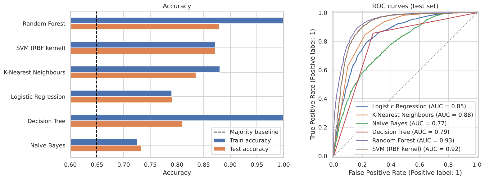
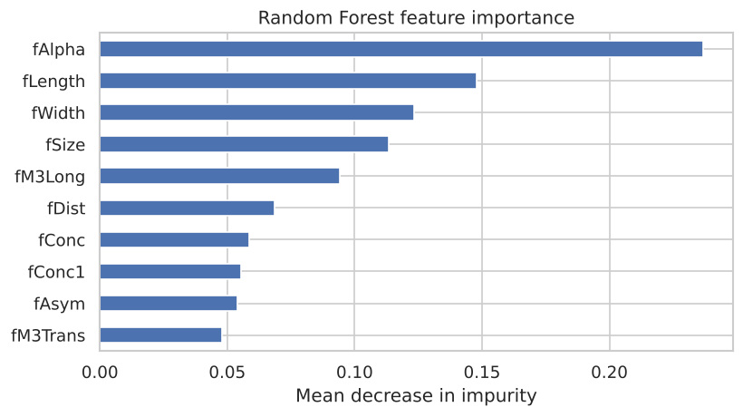

# Gamma/Hadron Classification on the MAGIC Telescope Dataset

This project compares six machine learning classifiers on the [MAGIC Gamma Telescope dataset](https://archive.ics.uci.edu/dataset/159/magic+gamma+telescope). The goal is to separate gamma-ray events (signal) from cosmic-ray hadron events (background).

## Background

MAGIC is a pair of ground-based Cherenkov telescopes. A high-energy particle that enters the atmosphere starts a shower of secondary particles. The shower emits Cherenkov light, and the telescope records it as an image. Gamma rays and hadrons both produce showers, but the images have different shapes. Each event in the dataset is described by 10 parameters of an ellipse fitted to the image.

The dataset contains 19,020 Monte Carlo simulated events. About 65% are gamma and 35% are hadron.

## Method

1. Load the data and check for missing values and duplicates.
2. Explore the feature distributions per class and the correlations between features.
3. Split the data into a stratified 75% training set and 25% test set.
4. Train six classifiers. Each one is a scikit-learn pipeline with a `StandardScaler`.
5. Evaluate each model with 5-fold cross-validation, test accuracy and test ROC AUC.

## Results

| Model | CV accuracy | Train accuracy | Test accuracy | Test ROC AUC |
|---|---|---|---|---|
| Random Forest | 0.877 | 1.000 | **0.880** | **0.933** |
| SVM (RBF kernel) | 0.867 | 0.872 | 0.872 | 0.916 |
| K-Nearest Neighbours | 0.834 | 0.881 | 0.836 | 0.878 |
| Logistic Regression | 0.790 | 0.790 | 0.792 | 0.847 |
| Decision Tree | 0.818 | 1.000 | 0.811 | 0.791 |
| Naive Bayes | 0.726 | 0.726 | 0.733 | 0.772 |

A model that always predicts gamma reaches 65% accuracy. All six models beat this baseline. Random Forest performs best. The single Decision Tree overfits: it is perfect on the training set but much weaker on the test set.



The most useful feature is `fAlpha`, the angle of the shower image. Gamma showers point towards the source, so their `fAlpha` is close to 0. Hadron showers arrive from all directions.



## Repository structure

```
.
├── data/
│   └── magic_gamma_telescope.csv           # UCI MAGIC Gamma Telescope dataset
├── figures/                                # plots generated by the notebook
├── notebooks/
│   └── magic_gamma_classification.ipynb    # full analysis
├── requirements.txt
└── README.md
```

## How to run

```bash
git clone https://github.com/ADITYA-WORK-MAITI/MAGIC-GAMMA-TELESCOPE.git
cd MAGIC-GAMMA-TELESCOPE
pip install -r requirements.txt
jupyter notebook notebooks/magic_gamma_classification.ipynb
```

Run the notebook from the `notebooks/` folder. It reads the data from `../data/` and saves the plots to `../figures/`.

## Dataset

Bock, R. (2004). *MAGIC Gamma Telescope* [Dataset]. UCI Machine Learning Repository. https://doi.org/10.24432/C52C8B. Licensed under [CC BY 4.0](https://creativecommons.org/licenses/by/4.0/).
